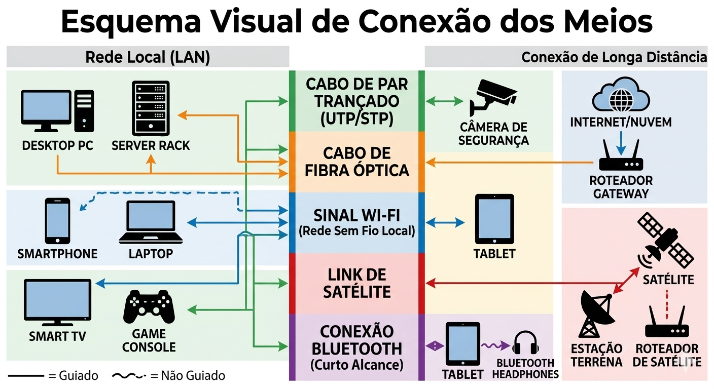
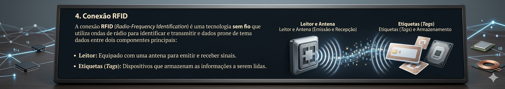

# Aula 11 – Redes de Computadores: Topologias, Dispositivos e Meios

## Objetivo
Entender a organização física e lógica das redes, identificar os principais dispositivos e reconhecer os diferentes meios de transmissão.

## Estrutura da Entrega
Cada grupo deve incluir neste repositório:

### 1. Diagramas de Topologias

  - Diagrama Estrela (Star)
    
    ](https://github.com/LucasBarretoDev-eng/Introducao-Computacao-1semestre/blob/main/Unidade%204%20/Imagens/Diagrama%20Estrela.png)
  - Diagrama Anel (Ring)
    
    ](https://github.com/LucasBarretoDev-eng/Introducao-Computacao-1semestre/blob/main/Unidade%204%20/Imagens/Diagrama%20Anel.png)
  - Diagrama Barramento (Bus)
    
    ](https://github.com/LucasBarretoDev-eng/Introducao-Computacao-1semestre/blob/main/Unidade%204%20/Imagens/Diagrama%20Barramento.png)
  - DIagrama Malha (Mush)

  - 
    ](https://github.com/LucasBarretoDev-eng/Introducao-Computacao-1semestre/blob/main/Unidade%204%20/Imagens/Diagrama%20Malha.png)

### 2. Quadro Comparativo de Dispositivos
](https://github.com/LucasBarretoDev-eng/Introducao-Computacao-1semestre/blob/main/Unidade%204%20/Imagens/Quadro%20comparativo.png)

### 3. Meios de Transmissão
  - Meios Guiados
    ](https://github.com/LucasBarretoDev-eng/Introducao-Computacao-1semestre/blob/main/Unidade%204%20/Imagens/MeiosGuiados.png)
  - Meios Não Guis
    ](https://github.com/LucasBarretoDev-eng/Introducao-Computacao-1semestre/blob/main/Unidade%204%20/Imagens/MeiosNaoGuiados.png)
  - Esquema Visual
    ](https://github.com/LucasBarretoDev-eng/Introducao-Computacao-1semestre/blob/main/Unidade%204%20/Imagens/EsquemaVisual.png)

### 4. Conexão RFID 

A conexão **RFID** (*Radio-Frequency Identification*) é uma tecnologia **sem fio** que utiliza ondas de rádio para identificar e transmitir dados entre dois componentes principais:

](https://github.com/LucasBarretoDev-eng/Introducao-Computacao-1semestre/blob/main/Unidade%204%20/Imagens/radio.png)

### 5. Reflexão Individual
- O protocolo que considero mais essencial para o funcionamento da Internet é o **TCP/IP (Transmission Control Protocol/Internet Protocol)**, pois ele é responsável por permitir a comunicação entre dispositivos conectados à rede. O IP cuida do endereçamento e do encaminhamento dos dados para o destino correto, enquanto o TCP garante que essas informações sejam entregues de forma organizada e sem perdas. Sem esse conjunto de protocolos, computadores, celulares e servidores não conseguiriam trocar informações corretamente. Por isso, o TCP/IP é considerado a base do funcionamento da Internet e de praticamente todos os serviços digitais utilizados atualmente.

